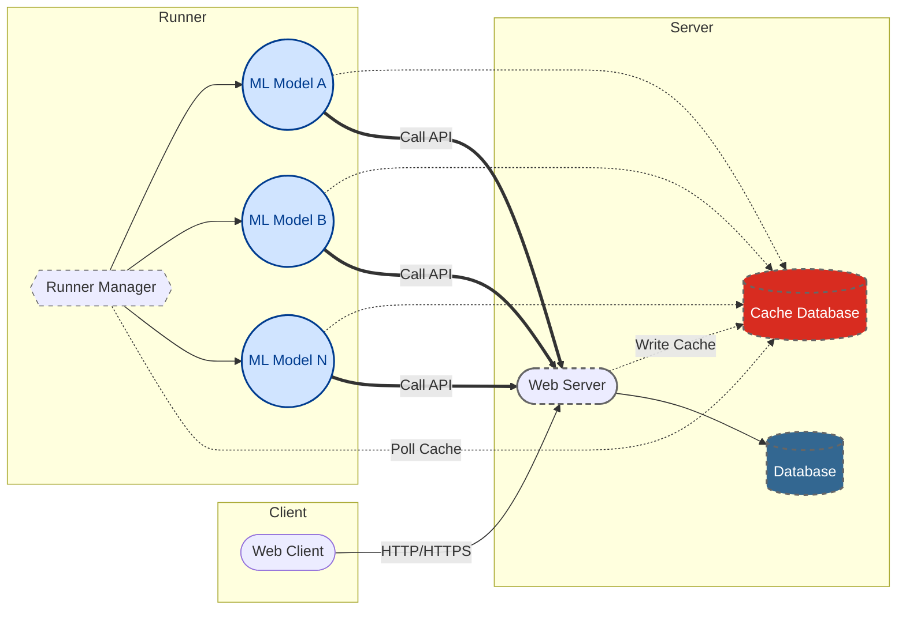

# 💧 Water Forecast

Water Forecast is a backend application built with **FastAPI**, responsible for serving AI-based water consumption forecasts, managing database interactions, and exposing RESTful APIs to frontend clients and AI modules like [water-forecast-ai].

## 🚀 Features

- **FastAPI server** with clean and modular architecture.
- **Database integration** using SQLAlchemy ORM with PostgreSQL.
- **Migrations** powered by Alembic for schema version control.
- **Redis support** for caching and fast access to AI-generated forecasts.
- **Structured configuration** with Pydantic-based settings.
- **Code quality** enforced with `ruff` and `mypy`.
- **Testing and coverage** with `pytest`.
- **Environment and tooling management** via `uv` and `pyproject.toml`.

## 🧭 System Architecture

The diagram below illustrates the initial architecture design for the Water Forecast system, highlighting the interaction between the web client, FastAPI server, cache/database layers, and AI runner models.



## ⚙️ Environment Setup

This project uses [uv] for Python environment and dependency management.

### Install uv

```bash
curl -LsSf https://astral.sh/uv/install.sh | sh
```

### Create and activate virtual environment

```bash
uv venv .venv
source .venv/bin/activate
```

### Install development dependencies

```bash
uv pip install -e ".[dev]"
```

## 🔒 Dependency Locking

To generate a lockfile for reproducible environments:

```bash
pip-compile pyproject.toml --extra=dev --output-file=requirements.lock.txt
```

This ensures all dependencies (including transitive ones) are pinned and can be synced across environments with full reproducibility.

## 🧪 Running Tests

After activating the virtual environment:

```bash
pytest
```

With coverage report:

```bash
pytest --cov=water_forecast --cov-report=term-missing
```

## 🧹 Code Quality Checks

### Run Ruff (linter & formatter)

```bash
ruff check water_forecast
```

### Run Mypy (type checker)

```bash
mypy water_forecast
```

## 🌐 API Documentation

Once the server is running, access the interactive API docs at:

```
http://localhost:8000/docs
```

Or the alternative ReDoc view:

```
http://localhost:8000/redoc
```

---

This backend service is designed to work in tandem with [water-forecast-ai] and frontend clients for delivering accurate and real-time water consumption predictions.

[uv]: https://github.com/astral-sh/uv
[water-forecast-ai]: https://github.com/ramironunes/water-forecast-ai/
